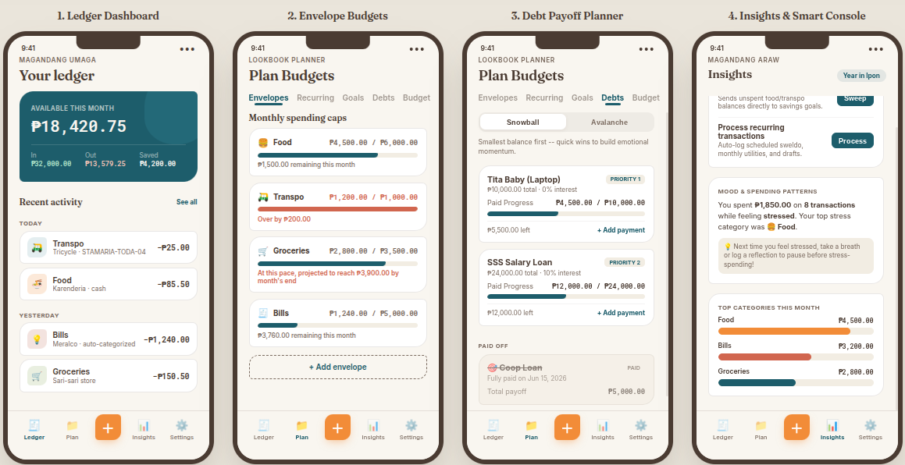

# 🪙 Ipon

> An offline-first, zero-login personal expense journal built specifically for the Philippine market.

**Ipon** (Tagalog for "save" or "savings") is an opinionated personal finance app. It rejects the modern trend of syncing your bank accounts to the cloud, mining your transaction data, or pretending to use "AI" to predict your life. It is designed to feel like a high-quality physical journal: private, exact, and entirely under your control.

## 📥 Download

You can download the latest version of Ipon directly to your Android device:

*(Note: You may need to enable "Install from unknown sources" in your Android settings to install the APK directly.)*

---

## 📸 Screenshots

  

---

## 🔒 Privacy & Philosophy

This project is governed by strict technical and design rules to protect your data and your peace of mind:

* **Structurally Offline:** There are no accounts, no passwords, and absolutely no internet permissions in the app. Your data never leaves your device unless you manually export it.
* **Never Auto-Write:** Recurring transactions are treated as templates that require your manual confirmation. The ledger never posts an entry behind your back.
* **Centavo-Exact Math:** All currency is stored using exact integer math. Floating-point drift is structurally impossible, ensuring your balance is always accurate to the last centavo.
* **Honest Automation:** The app learns your habits (like your preferred category for a specific local merchant) purely from your own corrections, saved locally. No cloud sync, no multi-user data sharing.

---

## ✨ Features

* **Philippine-Aware Categorization:** Built-in categories that reflect real local spending and income (e.g., *Sweldo, OFW Remittances, Sari-sari income, Abuloy, Government / Dues*).
* **Envelope Budgeting:** Monthly spending caps per expense category.
* **Zero-Based Budgeting & 50/30/20:** Map your active income against envelopes and recurring expenses so every peso has a job.
* **Payday Safe-Spend Pacing:** Set your exact paydays (e.g., 15th and 30th) to automatically calculate your safe daily spend limit based on your available balance.
* **Debt Payoff Tracker:** Optimize debt clearing using either the Snowball (momentum) or Avalanche (mathematically optimal) methods.
* **Append-Only Goals:** Savings targets with a dedicated contribution log, showing real money moved rather than an arbitrary progress bar.
* **Daily Reflection:** A calm, mindful ritual embedded on the ledger to pair your daily spending with a simple mood check-in.
* **Smart Console:** Pace-based envelope runway projections, recurring pattern detection, and one-tap sweeps of unspent envelope budgets directly to savings goals.
* **Full Data Ownership:** A one-tap export to generate a complete CSV of your entire financial history to your local `Downloads` folder.

---

## 🎨 Visual Identity

Ipon rejects the generic, glossy, 3D-heavy aesthetics of standard finance apps in favor of an **editorial, print-lookbook visual language**:

* **Background:** Rice Paper (`#F9F6F0`) — providing a physical, tactile canvas.
* **Structure:** Ocean Teal (`#1D5D6B`) — deep and calming for primary navigation.
* **Action:** Jeepney Orange (`#F28C38`) — reserved *strictly* for action triggers and primary buttons.
* **Alerts:** Terracotta (`#D1664F`) — reserved *strictly* for over-budget warnings or destructive actions.
* **Geometry:** Organic, slightly asymmetric "squircle" shapes, avoiding clinical, perfectly rounded corners. 
* **Offline Typography:** Bundled variable fonts (`Fraunces` and `Inter`) guarantee a high-end, tabular-serif editorial look without requiring Google Play Services or network fetches.

---

## 🛠 Tech Stack

* **Platform:** Native Android (Minimum API 26)
* **Language:** Kotlin
* **UI:** Jetpack Compose (Material 3 foundation, customized for flat/print aesthetics)
* **Local Storage:** Room over SQLite 

## 🤝 Contributing
As an offline-first app, pull requests focused on UI polish, local performance, and expanding the offline Philippine merchant rulebook are highly encouraged. Please ensure any new features respect the zero-cloud privacy philosophy.